# 透過Pthon撈取Notion資料


# 動機

本文旨在介紹一種透過 Python 擷取 Notion 平台上表格（資料庫）資料的方法，以提供使用者便捷的資料管理、備份和其他應用功能。此外，本文還進一步探討常見的表格建立錯誤，這些錯誤往往導致無法正確取得資料庫識別碼，進而影響資料擷取過程。為了解釋相關過程，我將提供詳盡的範例，最終呈現成功擷取資料的畫面。

# Step 1 : 從Notion建立Table

依照下列動畫製作表單(Table)

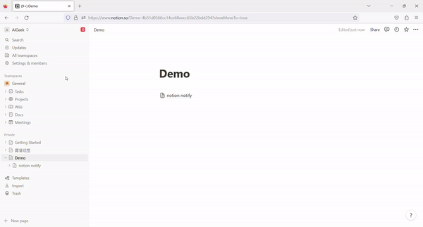

常見錯誤 - 導致無法正確取得資料庫的識別碼（database ID）

(1) *正常不會有下圖綠色框，如果發現類似下圖這樣，請按紅色框(箭頭)就可以轉成正常表單*

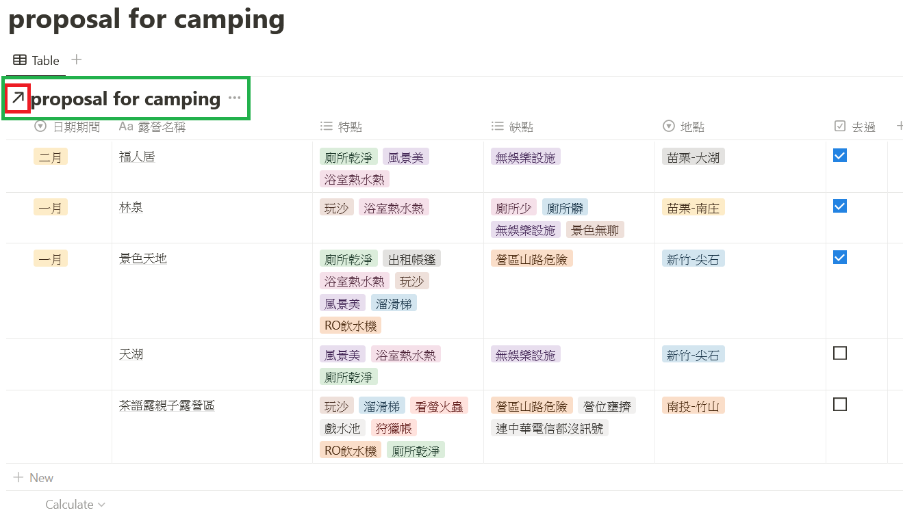

(2)正*常不會有下圖綠色框，如果發現類似下圖這樣，請照Step1 (步驟1) 建立表單*

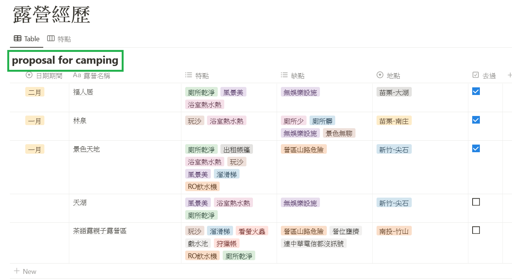

# Step 2 : 建立表格資料

以下是我表格內容與資料，這些是過去露營區做個評比，大致上都不錯，但是對每個人的標準都無法一致，因此這裡做了一點量化的指標做給大家參考

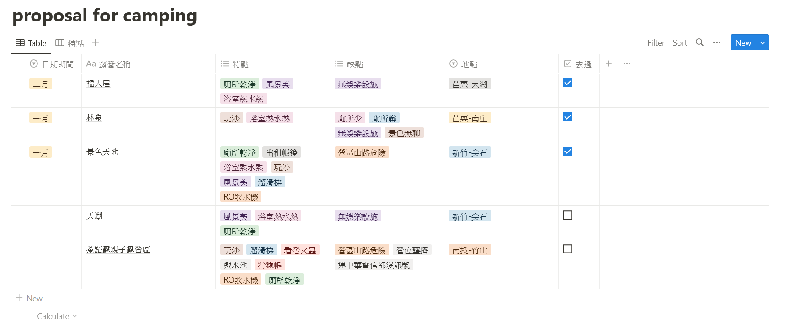

# Step 3 : 建立Connection

這裡非常重要，Notion要跟python做資料互相連接，就需要申請Token，此Token跟申請Line的方式很類似(後續會提到)，但是Notion是針對某個頁面做開啟Connection才可以做互相連接，此外那個Connection必須要做申請也就是Token申請，下圖兩個步驟進入到Integreation頁面

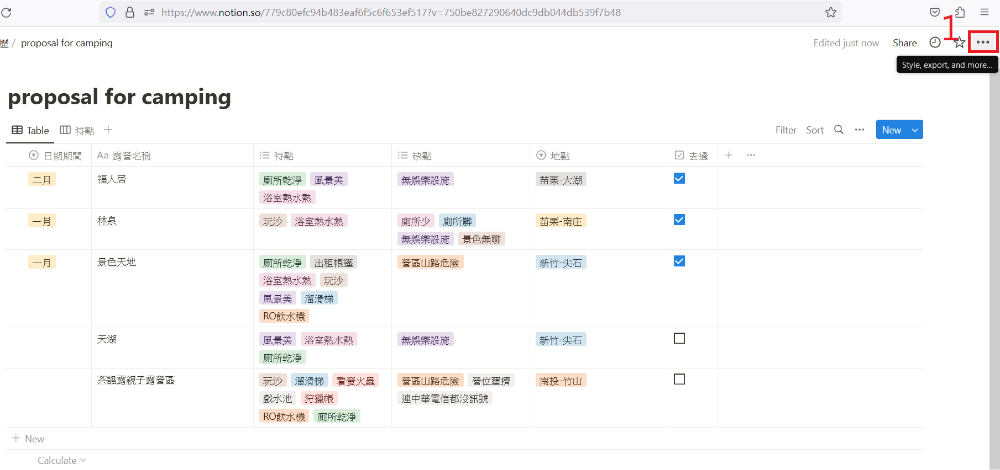


# Step 4 : Notion Token申請頁面

如紅色框，案開啟create new integration

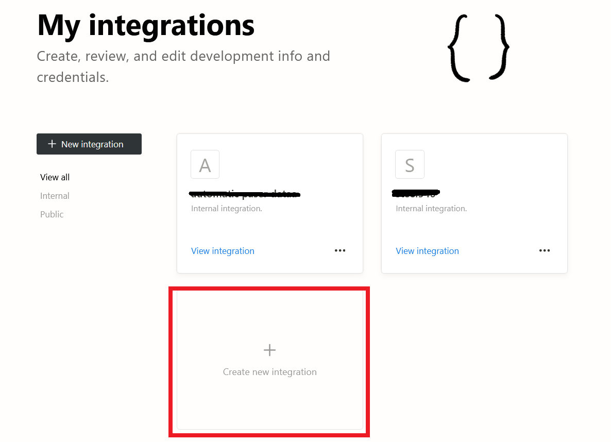

# Step 5 輸入申請資料

輸入名稱(Name)，此名稱可以隨意輸入但是要記得此名稱是未來對照Token(Connection)的名稱

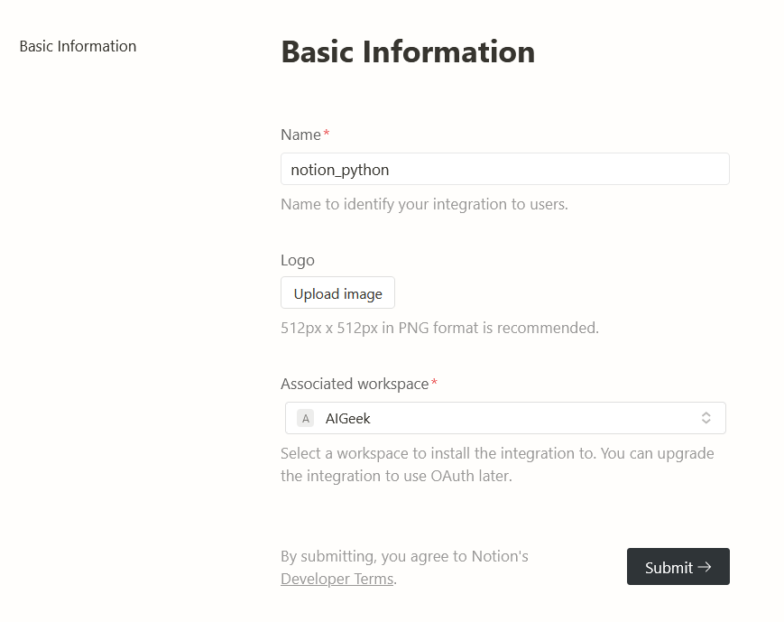

# Step 6 複製Token序號

這裡我輸入notion_python名稱當作Token序號，請把此序號記錄起來，等等python會需要使它當作連結驗證資訊

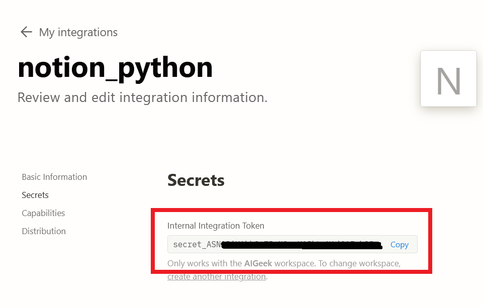

# Step 7 設定Notion連結頁面

把您剛剛建立好的頁面資訊做設定，這時候應就會有您剛剛設定的Coneection頁面名稱，我們connection名稱為notion_python

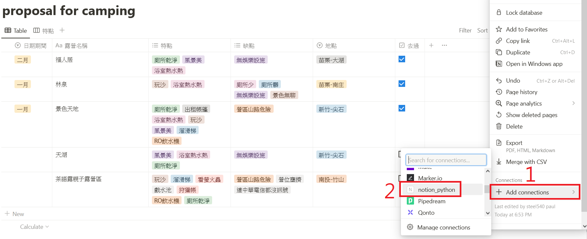

此外還有一個重點就是，除了輸入connection外，還要記錄您的database ID，如紅色字體內的字串為database ID: **779c80efc94b483eaf6f5c6f653ef517**

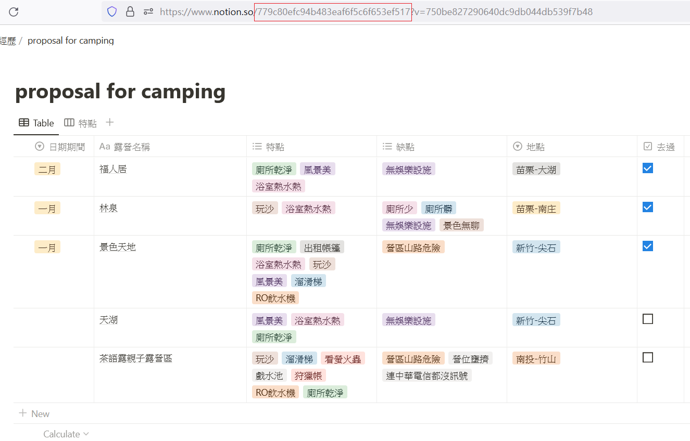

# Step 9 程式碼之範例

跟python做連接必須要有兩個資訊，1. token 2. database ID，這兩個資訊在上面步驟6與7已經提供如何取得，此時我的範例表單共有六個欄位，1. 日期期間 (欄位屬性:Select), 2. 露營名稱 (欄位屬性:Title), 3. 特點 (欄位屬性:Multi-select), 4. 缺點 (欄位屬性:Multi-select), 5. 地點 (欄位屬性:Select), 6. 去過 (欄位屬性:Checkbox)，這些屬性名稱都對應到我以下的程式碼做資訊擷取，最後我再用Dataframe做資料儲存

```python
import pandas as pd
from notion_client import Client

# 設定 Notion API Token 和 Database ID
notion = Client(auth="secret_輸入您的Notion Token")

database_id = "779c80efc94b483eaf6f5c6f653ef517"
               
# 取得資料庫中的所有資料
results = notion.databases.query(database_id).get("results")

# 將 Notion 資料轉換成 Pandas DataFrame
data = []
for item in results:
    try:
        date = item["properties"]["日期期間"]["select"]["name"]
    except:
        date = None
    try:
        name = item["properties"]["露營名稱"]["title"][0]["text"]["content"]
    except:
        name = None
    try:
        features = [option["name"] for option in item["properties"]["特點"]["multi_select"]]
    except:
        features = None
    try:
        drawbacks = [option["name"] for option in item["properties"]["缺點"]["multi_select"]]
    except:
        drawbacks = None
    try:
        location = item["properties"]["地點"]["select"]["name"]
    except:
        location = None
    try:
        visited = item["properties"]["去過"]["checkbox"]
    except:
        visited = None

    data.append([date, name, features, drawbacks, location, visited])

df = pd.DataFrame(data, columns=["日期期間", "露營名稱", "特點", "缺點", "地點", "去過"])

# 儲存成 CSV 格式
df.to_csv('camping_dataframe.csv', index=False)
```

結果，綠色是Notion上的頁面，紅色是python頁面(我的開發UI是spyder)

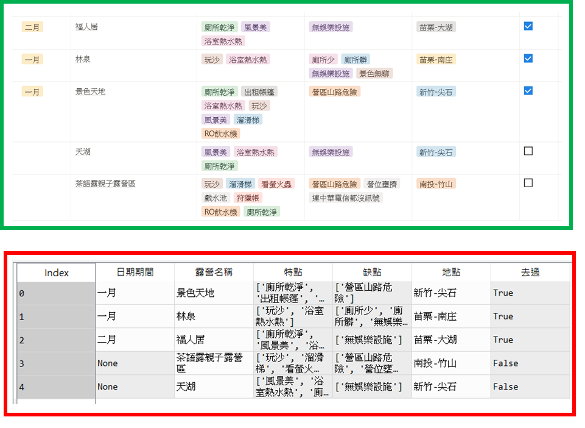

# 結論

本文介紹了透過 Python 擷取 Notion 平台上表格（資料庫）資料的方法，並提供了詳盡的範例和常見的表格建立錯誤。文章中提供了必要的步驟，包括建立表格、建立 Connection、Notion Token 申請頁面等，並提供了 Python 程式碼範例。這個方法可以提供使用者便捷的資料管理、備份和其他應用功能。
